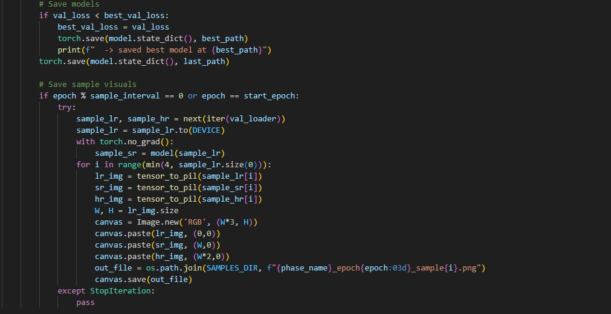
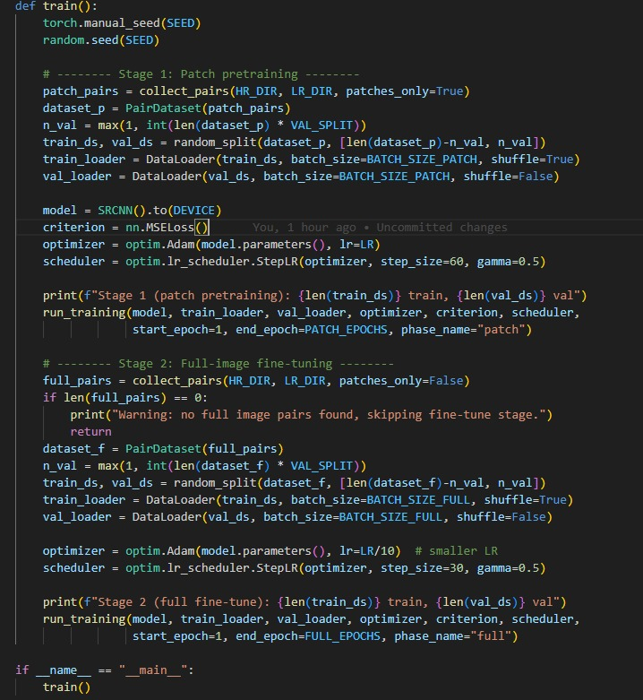
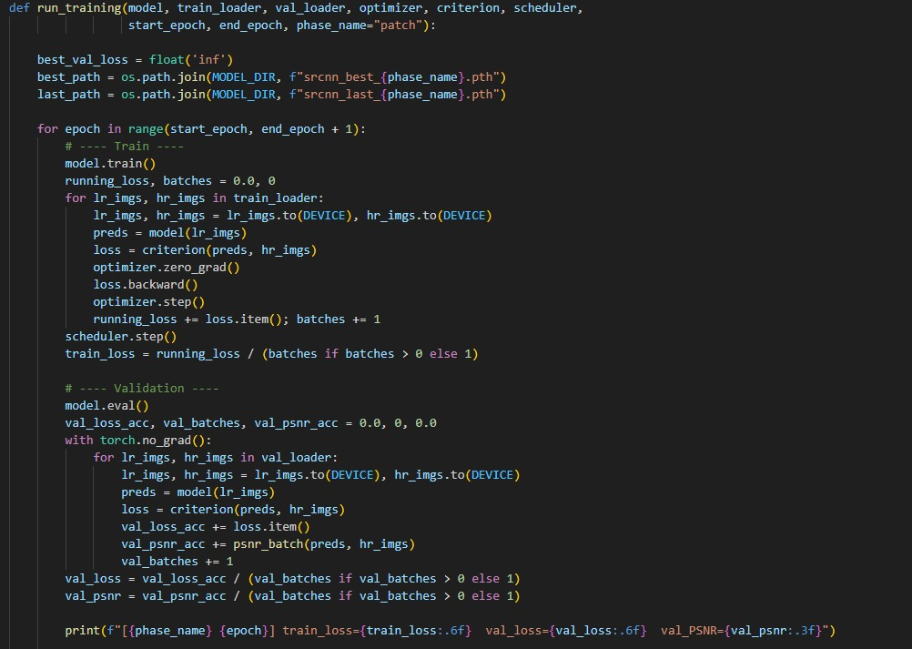
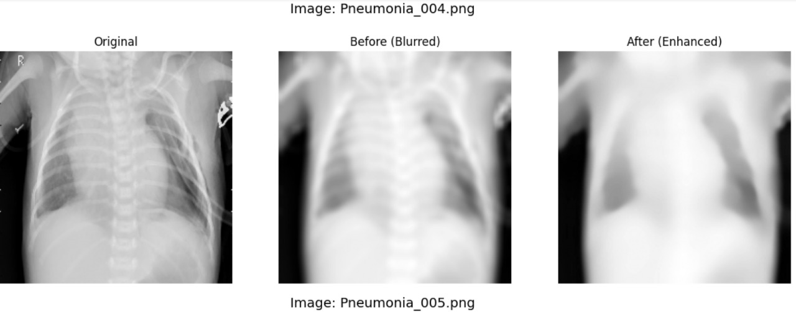
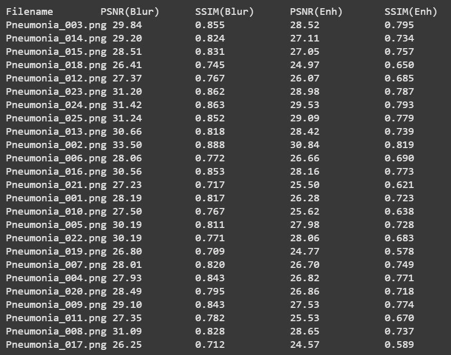

# Milestone 2 — Detailed Documentation

Project: EHR Imaging Documentation System – Image Enhancement

Team: Team B

---

## 1. Title Page

- Project Title: EHR Imaging Documentation System – Image Enhancement
- Team Name & Task Division -Members: Team B
  
  Preprocessing of Images - Pragya and Bhoomika
  
  Technique for Enhancement - Hamsini and Harshith
  
  Validate the Improvement - Shreepurna and Chandra Sekhar
  
  Documentation work - Iswarya and Anusha

- Mentor: Aryan Khurana
- Date of Submission: 16-09-2025

---

## 2. Introduction

The EHR Imaging Documentation System is designed to handle, process, and enhance medical images before they are stored in Electronic Health Records (EHRs).

- Medical images like X-rays, MRIs, CT scans often suffer from noise, blur, and low contrast.
- Doctors may struggle to interpret such unclear images, which can delay or mislead diagnosis.
- Image enhancement improves contrast, sharpness, and clarity, making important details visible.
- This milestone focuses on improving image quality using SRCNN (Super-Resolution Convolutional Neural Network).
- Clear and high-quality images are essential for accurate diagnosis.

Why this is important:

- Better image quality leads to accurate clinical decisions.
- Enhanced images ensure that the EHR system has standardized, clear, and reliable data.

---

## 3. Objective of Milestone 2

The objective is very clear:

To implement and demonstrate basic image enhancement techniques on medical images.

This milestone focuses on:

- Taking raw input medical images.
- Applying preprocessing techniques.
- Comparing the original vs enhanced results visually.

Objective: Implement and demonstrate SRCNN-based image enhancement on medical images.

Goals:

- Create low-quality (LQ) images by blurring original high-quality (HQ) medical images.
- Generate patches from HQ and LQ images for training.
- Train SRCNN on paired patches.
- Reconstruct full enhanced images from predicted HQ patches.
- Validate enhancement visually and quantitatively.
- Validate enhancement using PSNR and SSIM metrics.

---

## 4. Methodology

### 4.1 Dataset

- We used sample medical images (stored in `data/images/` folder).
- `mapping.csv` was used to map images with their descriptions.
- Example: an X-ray image file is linked to metadata for easier identification.
- HQ–LQ paired datasets were generated.
- Images were divided into patches (e.g., 32×32 pixels) for efficient SRCNN training.

### 4.2 Tools and Libraries

We worked in Python because of its strong support for image processing.

Libraries used:

1. OpenCV → Core library for reading images, applying filters, histogram equalization, CLAHE, denoising, blurring, etc.
2. Matplotlib → For displaying images (before and after enhancement).
3. NumPy → For handling pixel values and matrix transformations.
4. scikit-image → For image quality evaluation using PSNR (Peak Signal-to-Noise Ratio) and SSIM (Structural Similarity Index).
5. TensorFlow / Keras → Build and train SRCNN.

### 4.3 Enhancement Techniques Applied

SRCNN (Super-Resolution Convolutional Neural Network)

Input: Low-quality (blurred) image patches.

Output: Reconstructed high-quality patches.

Step-by-Step Process:

## Preparing HQ–LQ Image Patches

Extracted patches from HQ and LQ images.

Patches increase dataset size and allow SRCNN to learn fine details.

## Main Function for End-to-End Training

Runs full training on patches and images.

Feeds LQ patches to SRCNN, reconstructs HQ patches, calculates loss.

## Training Model and Saving Best Parameters

Trains SRCNN using HQ–LQ patch pairs.

Saves model weights with the lowest loss for inference.

## Advantage:

- Learns complex mappings from LQ to HQ images.
- Produces sharper and more natural enhancements suitable for medical diagnosis.

---

## 5. Implementation

### 5.1 Steps Taken

- Read original HQ images.
- Applied Gaussian blur to create LQ images.
- Normalized pixel values to [0, 1].
- Extracted HQ–LQ patches for SRCNN training.
- Built and trained SRCNN on patch pairs.
- Predicted HQ patches from LQ patches and reconstructed full images.
- Compared LQ images vs SRCNN-enhanced images visually.

### 5.2 Validation of Image Enhancement

- Uploaded original medical images and converted them to grayscale.
- Applied Gaussian Blur to create low-quality/noisy versions.
- Enhanced images using Fast Non-Local Means Denoising and Unsharp Masking.
- Compared Original, Blurred, and Enhanced images visually side by side.
- Computed PSNR and SSIM; Enhanced images showed higher metrics, confirming improved quality.

### 5.3 Implementation Screenshots

Before and After comparison:

Metrics output Comparison:

---

## 6. Results

### 6.1 Visual Results

We displayed side-by-side comparisons of original vs enhanced images.

- Blurring (Comparison):

  - Clear loss of sharpness and medical details.
  - Used to justify why enhancement is required.

### 6.2 Quantitative Results

We calculated quality metrics for validation:

- PSNR (Peak Signal-to-Noise Ratio): Higher means better quality.
- SSIM (Structural Similarity Index): Closer to 1 means more similarity to original but clearer.

---

## 7. Conclusion

- Successfully implemented basic enhancement techniques.
- Results show clear improvement in visibility and diagnostic usefulness.

---

## 8. References

- OpenCV Documentation – [https://docs.opencv.org/](https://docs.opencv.org/)
- Scikit-image Documentation – [https://scikit-image.org/](https://scikit-image.org/)

